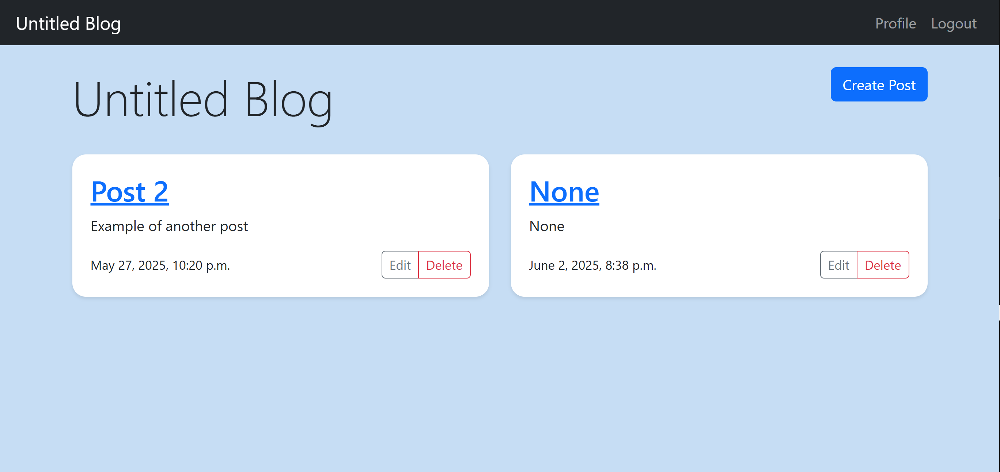

# 📝 Django Blog Project

This Django project is a **simple blog and user authentication system** built with **Django 5.2**. 
It allows users to register, log in, and manage blog posts with full CRUD (Create, Read, Update, Delete) functionality. 
The project includes two main apps — **`blog`** and **`users`** — and uses **Crispy Forms with Bootstrap 4** for clean, responsive UI components.

---


## Preview



---


## 🚀 Features

- 🧑‍💻 User registration, login, logout, and profile management  
- 📰 Blog post management with create, edit, delete, and detail views  
- 🔐 Authentication protection for creating and managing posts  
- 🧱 Uses Django’s class-based and function-based views  
- 🎨 Styled with **Bootstrap 4** via `crispy_forms`  
- 🧩 SQLite as the default database  
- ⚙️ Organized project structure following Django best practices  

---

## 🛠️ Tech Stack

- **Backend:** Django 5.2, Python 3  
- **Frontend:** Bootstrap 4 (via Django Crispy Forms)  
- **Database:** SQLite  
- **Authentication:** Django built-in auth system  

---

## Requirements
- Python 3.x
- Dependencies listed in `requirements.txt`

> Dependencies are pinned to versions known to work as of 2025.


## ⚙️ Setup Instructions

### 1. Clone the repository
```bash
git clone <repository-url>
cd <project-folder>
```

### 2. Create a virtual environment
```bash
python -m venv .venv
source .venv/bin/activate   # On Windows use: .venv\Scripts\activate
```

### 3. Install dependencies
```bash
pip install -r requirements.txt
```

### 4. Run migrations
```bash
python manage.py migrate
```

### 5. Create a superuser (optional)
```bash
python manage.py createsuperuser
```

### 6. Run the development server
```bash
python manage.py runserver
```

Then visit `http://127.0.0.1:8000/` in your browser.

---

## 📸 Preview
>Images were captured on different devices and resolutions during development; UI styling may vary slightly due to responsive behavior


---

## 📂 Project Structure

```
root
│
├── src/
│   ├── blog/
│   │   ├── models.py        """Database models for blog posts."""
│   │   ├── views.py         """Views for displaying and managing blog content """
│   │   ├── urls.py          """URL patterns for the blog application."""
│   │   └── templates/blog/
│   │
│   ├── users/
│   │   ├── views.py         """User-related views such as profile and authentication helpers."""
│   │   ├── forms.py         """Forms used for user registration and profile updates."""
│   │   ├── urls.py          """URL patterns for user-related views."""
│   │   └── templates/users/
│   │
│   ├── myproject/
│   │   ├── settings.py      """Django settings for the myproject project."""
│   │   ├── urls.py          """Root URL configuration for the project."""
│   │   ├── asgi.py
│   │   └── wsgi.py
│   │
│   └── manage.py            """Django's command-line utility for administrative tasks."""
│
├── README.md
├── requirements.txt 
└── .gitignore

```

---

## 📜 License

This project is open-source and free to use for educational and personal purposes.
